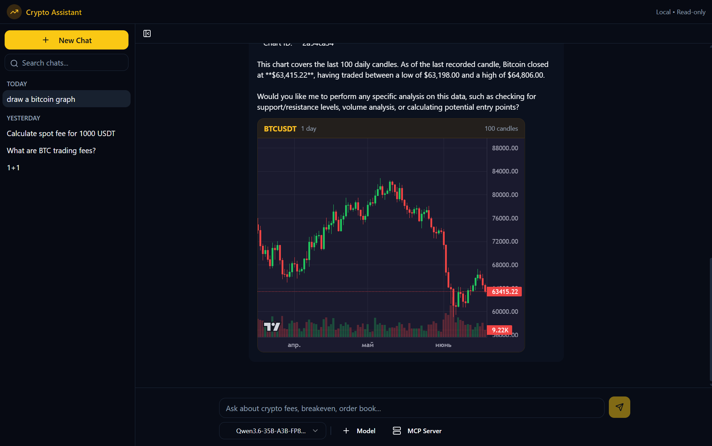

# Crypto Assistant

A local AI-powered crypto trading analysis tool with candlestick chart rendering. Connects to Binance via MCP tools for real-time market data — read-only, no auto-trading.



## Features

- **Live market data** from Binance (spot & futures) via MCP tools
- **Candlestick charts** rendered with TradingView Lightweight Charts
- **Fee analysis** — compare trading fees across symbols and market types
- **Breakeven calculator** — how much price must move to cover entry/exit fees
- **Order book imbalance** — detect bid/ask skew at any depth
- **Funding rate scanner** — find funding/carry opportunities on futures
- **Spot vs Perp comparison** — which is cheaper after fees
- **Russian language support** — ask questions in Russian (`нарисуй график биткоина`)
- **Local LLM** — runs with any OpenAI-compatible API (Ollama, vLLM, etc.)

## Example Queries

| Query | What It Does |
|-------|-------------|
| `What are the trading fees on BTC/USDT?` | Fetches and displays fee schedule |
| `Calculate breakeven move for ETH futures with 10x leverage` | Shows % price move needed to cover fees |
| `Show order book imbalance for BTCUSDT` | Analyzes bid/ask volume skew |
| `What's the current funding rate for ETHUSDT?` | Returns live funding rate |
| `Which symbol has the lowest effective fee?` | Scans and ranks symbols |
| `Compare spot vs perp for SOL` | Side-by-side fee comparison |
| `Draw a candlestick chart of BTCUSDT` | Renders interactive TradingView chart |
| `нарисуй график биткоина` | Draws BTC chart (Russian supported) |

## Architecture

```
┌──────────────┐     ┌──────────────┐     ┌──────────────┐
│   Frontend   │────▶│   Backend    │────▶│  MCP Server  │
│  React + Vite│     │   FastAPI    │     │   FastMCP    │
│  Nginx :80   │     │  :8000       │     │  :9000       │
└──────────────┘     └──────┬───────┘     └──────┬───────┘
                           │                     │
                           ▼                     ▼
                   ┌──────────────┐     ┌──────────────┐
                   │  LLM API     │     │  Binance API │
                   │  (Ollama/    │     │  (read-only) │
                   │   vLLM/etc)  │     │              │
                   └──────────────┘     └──────────────┘
```

**Frontend** — React SPA with shadcn/ui, serves via Nginx. Renders candlestick charts with [lightweight-charts](https://github.com/tradingview/lightweight-charts) v5.

**Backend** — FastAPI chat service. Connects to any OpenAI-compatible LLM and calls MCP tools on behalf of the model. Manages conversation history.

**MCP Server** — FastMCP server exposing crypto analysis tools. Fetches data from Binance REST API with rate limiting and caching.

## Tech Stack

| Layer | Technology |
|-------|-----------|
| Frontend | React 18, Vite, TypeScript, shadcn/ui, Tailwind CSS |
| Charts | TradingView Lightweight Charts v5 |
| Backend | Python 3.12, FastAPI, OpenAI Python SDK |
| MCP Server | Python 3.12, FastMCP, httpx, tenacity |
| Reverse Proxy | Nginx (Alpine) |
| Containerization | Docker Compose |

## MCP Tools

| Tool | Description |
|------|------------|
| `get_spot_price` | Current spot price for a symbol |
| `get_fee_schedule` | Trading fees by symbol and market type |
| `get_symbol_info` | Symbol metadata (tick size, lot size, etc.) |
| `get_orderbook_snapshot` | Order book at configurable depth |
| `get_funding_rate` | Current funding rate (futures) |
| `calculate_breakeven_move` | % move needed to cover entry/exit fees |
| `calculate_orderbook_imbalance` | Bid/ask volume imbalance ratio |
| `scan_low_fee_symbols` | Top-N symbols with lowest fees |
| `compare_spot_vs_perp` | Spot vs futures fee comparison |
| `get_kline_chart` | Candlestick chart data (OHLCV) |

## Quick Start

### Prerequisites

- [Docker](https://docs.docker.com/get-docker/) and Docker Compose
- An OpenAI-compatible LLM endpoint (Ollama, vLLM, or remote API)

### 1. Clone and configure

```bash
git clone https://github.com/YOUR_USERNAME/Crypto_assistant.git
cd Crypto_assistant
cp .env.example .env
```

### 2. Edit `.env`

```env
# LLM Configuration
OPENAI_API_KEY=your-api-key        # "ollama" for local Ollama
OPENAI_API_BASE=http://ollama:11434/v1  # or your vLLM/remote endpoint
MODEL_NAME=Qwen3.6-35B-A3B-FP8    # any OpenAI-compatible model

# Binance API (optional — public endpoints work without keys)
BINANCE_API_KEY=
BINANCE_API_SECRET=
```

### 3. Launch

```bash
docker compose up -d --build
```

Open [http://localhost:3000](http://localhost:3000)

### Using with Ollama

Add an Ollama service to `docker-compose.yml`:

```yaml
  ollama:
    image: ollama/ollama
    ports:
      - "11434:11434"
    volumes:
      - ollama-data:/root/.ollama
```

Then set in `.env`:
```env
OPENAI_API_BASE=http://ollama:11434/v1
MODEL_NAME=Qwen3.6-35B-A3B-FP8
```


## Disclaimer

This tool is for **informational purposes only**. It does not provide financial advice and does not execute trades. Always do your own research and consult a qualified financial advisor before making trading decisions.
